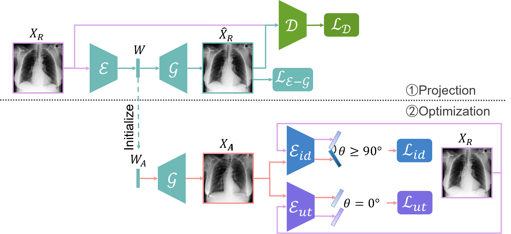
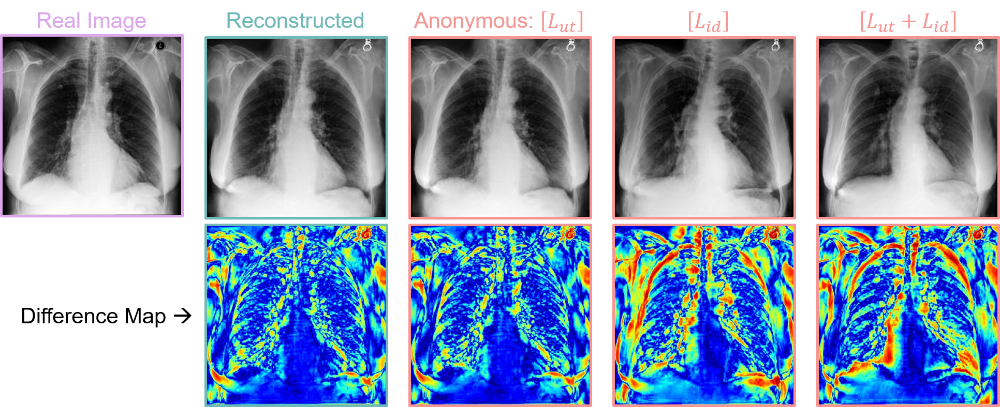

## GMIA-Generative Medical Image Anonymization &mdash; Official PyTorch implementation



**Generative Medical Image Anonymization Based on Latent Code Projection and Optimization**<br>
Huiyu Li, Nicholas Ayache, Hervé Delingette<br>
<!-- ToDo<br> -->
[**Data Exfiltration and Anonymization of Medical Images based on Generative Models** (Chapter3-4)](https://inria.hal.science/tel-04875160)<br>
Huiyu Li<br>

## Requirements
* 64-bit python==3.7, pytorch==1.7.1 torchvision==0.8.2 torchaudio==0.7.2 cudatoolkit=11.0 -c pytorch. See [https://pytorch.org/](https://pytorch.org/) for PyTorch install instructions.

## Preparing Datasets
**MIMIC-CXR-JPG**:<br>
Step 1: Download the [MIMIC-CXR-JPG dataset](https://physionet.org/content/mimic-cxr-jpg/2.1.0/).

Step 2: Dataset Pre-processing accoring to the [repository](https://github.com/Huiyu-Li/GMIA-Dataset-Pre-processing/tree/main).

## Training the Networks

### [Identity and Utility network training](https://github.com/Huiyu-Li/GMIA-Feature-Extractor-Training/tree/main)

### Image reconstruction network training
```.bash
python3 Model_Pretrain/reco.py --gpus=1 --cfg=auto25k --g_reg=True --cogd=True
```

Evaluation
```.bash
python3 Evaluate/reco_evaluation.py
```

## Feature Extraction
### Identity feature extraction
```.bash
python3 Optimize/extraction.py --choice=identity
```

### Utility feature extraction
```.bash
python3 Optimize/extraction.py --choice=utility
```

### Latent code extraction
```.bash
python3 Optimize/extraction.py --choice=latent
```

## Latent Code Optimization
```.bash
python3 Optimize/optimization.py --vis_env='w space id_margin=-0.7' \
--start=0 --end=6851 \
--mode=train --cfg=auto --id_margin=-0.7 --lambda_id=1 --lambda_ut=1 \
--semantic="DIR to the identity and utiliyt semantic features" \
--latent="DIR to the latent codes" \
--g_ckpt="DIR to the pre-trained image reconstruction networks"
```



## [Quality Metrics](https://github.com/Huiyu-Li/GMIA-Feature-Extractor-Training/tree/main)

### Identity elimination
Evaluate the Inner linability risk of the anonymized dataset.<br>
```.bash
python3 ./Evaluate/identityI_eval.py
```

Evaluate the Outer linability risk of the anonymized dataset.<br>
```.bash
python3 ./Evaluate/identityO_eval.py
```

### Utility preservation
Evaluate the utility network on the anonymized dataset.<br>
```.bash
python3 ./Evaluate/utilityA_eval_CheXclusion_uDense.py
```

### Privacy metrics
Calculate the privacy metrics in the identity feature space.<br>
```.bash
python3 ./Privacy_Metrics/main_identity.py
```

Calculate the privacy metrics in the latent space.<br>
```.bash
python3 ./Privacy_Metrics/main_latent.py
```

References:
1. [StyleGAN2-ADA](https://github.com/NVlabs/stylegan2-ada-pytorch)
2. [FALCO](https://github.com/chi0tzp/FALCO)

## Citation

<!-- ToDo<br> -->
```
@article{li2025generative,
  title={Generative medical image anonymization based on latent code projection and optimization},
  author={Li, Huiyu and Ayache, Nicholas and Delingette, Herv{\'e}},
  booktitle={IEEE International Symposium on Biomedical Imaging (ISBI 2025)},
  year={2025}
}
@phdthesis{li2024data,
  title={Data exfiltration and anonymization of medical images based on generative models},
  author={Li, Huiyu},
  year={2024},
  school={Universit{\'e} C{\^o}te d'Azur}
}
```
